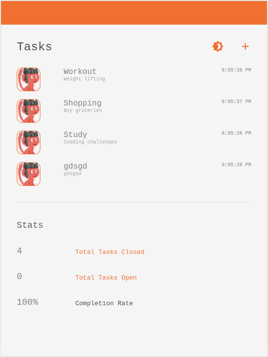

[![Contributors][contributors-shield]][contributors-url]
[![Forks][forks-shield]][forks-url]
[![Stargazers][stars-shield]][stars-url]
[![Issues][issues-shield]][issues-url]
[![MIT License][license-shield]][license-url]

<!-- PROJECT LOGO -->
 

<!-- ABOUT THE PROJECT -->
## About The Project
A simple task list
The main features of this app are:
- View tasks
- Add new tasks
- View tasks stats
- Toggle between dark and light mode

### Built With
Components of this project is listed below;

* React
* Material UI icons
* CSS
* Javascript - ES6
* VsCode
* EsLint

## [Live Demo](https://kind-austin-760a6d.netlify.app/)

<!-- GETTING STARTED -->
## Getting Started

This project has been deployed on Netlify, you can [visit page](https://kind-austin-760a6d.netlify.app/) or download/clone
repository from github to try it.

<!-- PROJECT SETUP -->
## Set up
* clone the repo using `https://github.com/oloomoses/my_tasks.git` command
* Run `cd my_tasks` to get into the project directory
* Run `npm install` to install the project dependencies

<!-- USAGE EXAMPLES -->
### Usage
* Run `npm start`
* Open the browser and enter `http://localhost:3000/`

### Test
* Run `npm run test`

## Author
👤 **Moses Oloo**

- Github: [@githubhandle](https://github.com/oloomoses)
- Twitter: [@twitterhandle](https://twitter.com/olooine)
- Linkedin: [linkedin](https://www.linkedin.com/in/oloomoses/)

<!-- CONTRIBUTING -->
## Contributing

Contributions are what make the open source community such an amazing place to be learn, inspire, and create. Any contributions you make are **greatly appreciated**.

1. Fork the Project
2. Create your Feature Branch (`git checkout -b feature/AmazingFeature`)
3. Commit your Changes (`git commit -m 'Add some AmazingFeature'`)
4. Push to the Branch (`git push origin feature/AmazingFeature`)
5. Open a Pull Request

<!-- ACKNOWLEDGEMENTS -->
## Acknowledgements
* [DoubleGDP](https://www.doublegdp.com/)
* [GitHub](https://github.com/)
* [Netlify](https://www.netlify.com/)
